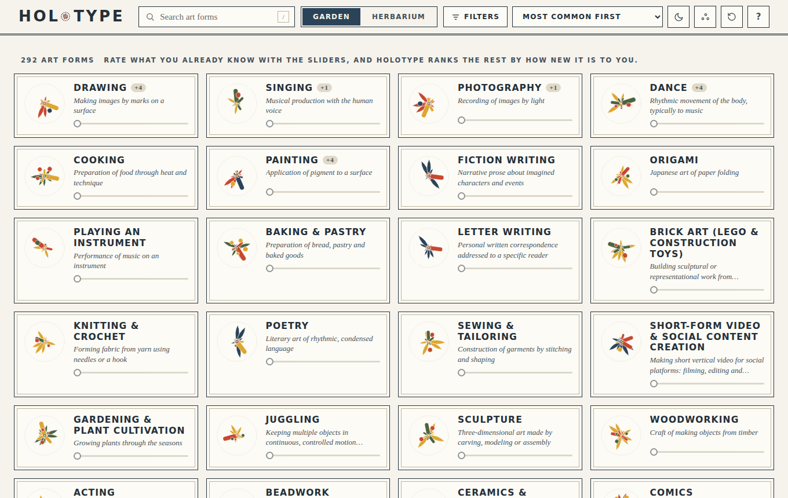
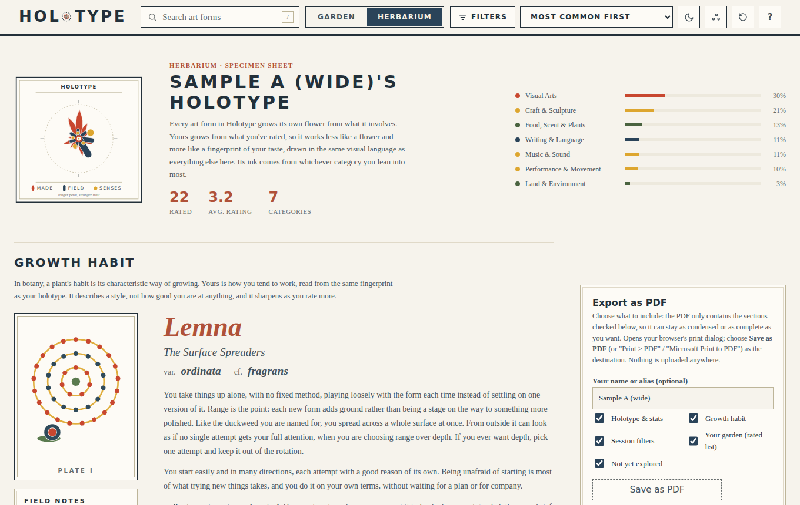

# Holotype

Holotype helps you find something creative to try next. Rate the art forms you've practiced, and browse the rest by how familiar or new they might be to you.

The catalogue has 292 art forms, from drawing and flamenco to chocolate work and pro wrestling. The Garden lets you rate and explore them. The Herbarium turns your ratings into a flower, a plant and a short profile, with lists you can save as a PDF.

The profile is a playful reading of your creative practice. Its references are simulated, and it has not been validated as a psychological test. See [how the model works](docs/model.md).




## Open the app

Open `index.html` in your browser. Double-clicking works; there is nothing to install.

For a copy you can send as one file, use `dist/Holotype.html`. It contains the same scripts, styles and translations as the folder version.

English is the default on a first visit and after Reset. Choose Español in the top bar to switch languages. Your browser remembers that choice, and loading a saved session restores its language when one is included.

Two fonts load from Google Fonts. Without a connection, the app uses system fonts. To use the hosted app offline, download the portable file first; the website does not currently cache itself for offline use.

## Your ratings

Ratings, tags, your name and your plant are stored in your browser. Holotype does not send them to a server.

Use **Save session** in the Herbarium to download a JSON file, then **Load session** to continue later or on another device. Your phone and computer have separate browser storage, so they do not sync automatically. Older session files still load, and ratings for missing art forms are kept aside for review.

Reset clears the current person's data and returns to English. It keeps the device's light/dark preference and selected PDF sections. Reloading or closing the browser keeps your saved ratings unless browser storage is cleared or unavailable.

## Host it on GitHub Pages

GitHub stores the source and its change history. GitHub Pages serves the app at a web address that works on a phone or computer. Public repositories can use Pages on GitHub's free plan.

This repository includes `.github/workflows/pages.yml`. It rebuilds the translations and portable file, checks the build in a browser, and publishes the app whenever `main` changes.

In the repository, open **Settings → Pages** and choose **GitHub Actions** as the source. The **Actions** tab shows the publishing run and its result. When it finishes, **Settings → Pages** gives you the website address, usually `https://xochilcahua.github.io/Holotype/`.

Open that address in your browser to use the app. You can also add it to your phone's home screen. The hosted app's footer links to its source repository.

See [the GitHub and publishing guide](docs/github.md) for first-time setup and future updates. GitHub's [Pages documentation](https://docs.github.com/en/pages/getting-started-with-github-pages/using-custom-workflows-with-github-pages) explains the hosting service.

## Explore the app

| Feature | What you can do |
| --- | --- |
| Garden | Rate forms with sliders; sort by popularity, familiarity, name, category or your own color tags. |
| Herbarium | Read your profile, browse rated and unexplored forms, and export selected sections as a PDF. |
| Related forms | Open a tile to see similar forms and links between broader and more specific practices. |
| Sessions | Save a file, load it elsewhere, or merge it with your current ratings. |
| Languages | Edit the text files in `copy/` or add another language folder. |

Filters and search apply to the Garden, Herbarium lists and PDF. A shortened list shows its visible count.

## Find your way around the source

| Path | Contents |
| --- | --- |
| `index.html` | Page markup and script load order. |
| `assets/` | Icons and the phone home-screen manifest. |
| `copy/` | English and Spanish text, plus the generated language bundle. |
| `src/data/` | Art forms, category relationships and participation estimates. |
| `src/model/` | Distances, novelty scores and profile classification. |
| `src/render/` | The generated plant drawing. |
| `src/ui/` | Ratings, filters, sessions, the Herbarium and printing. |
| `src/styles/` | Stylesheets. |
| `dist/Holotype.html` | The portable app. |
| `tools/` | Translation, portable-build and publishing tools. |
| `tests/` | Browser and model checks; see [the test guide](tests/README.md). |
| `docs/` | Architecture, model, translation and publishing guides. |

Scripts use classic `<script src>` tags so the folder version works from disk. Their order in `index.html` matters. See [the architecture guide](docs/architecture.md).

## Edit and check a change

For wording, edit the second line of an entry in `copy/English` or `copy/Español`; leave its first line alone. See [the copy guide](copy/README.md).

```sh
python3 tools/locales.py check
python3 tools/locales.py build
python3 tests/env_check.py
python3 tests/scan_order.py
python3 tools/build_singlefile.py
```

The translation build needs only Python 3. Browser checks and the portable-build comparison need Playwright with Chromium; `tests/env_check.py` explains how to set them up. Use the Python executable it reports. The source includes a Prettier configuration; catalogue and prevalence data are excluded from formatting.

To edit an art form, change its record in `src/data/art-forms.js`. You can change a description without changing the numerical model. If you change source text used as a translation key, run `python3 tools/locales.py extract` and update both language folders.

## Licence and credits

Code and catalogue data are licensed under [GNU AGPL v3 or later](LICENSE). The name and logo have a separate [trademark policy](TRADEMARK.md).

Made by Teo Monroy. Copyright (C) 2026. Contact: @xochilcahua.

The Google Fonts files are loaded at runtime and are not included in this repository.
